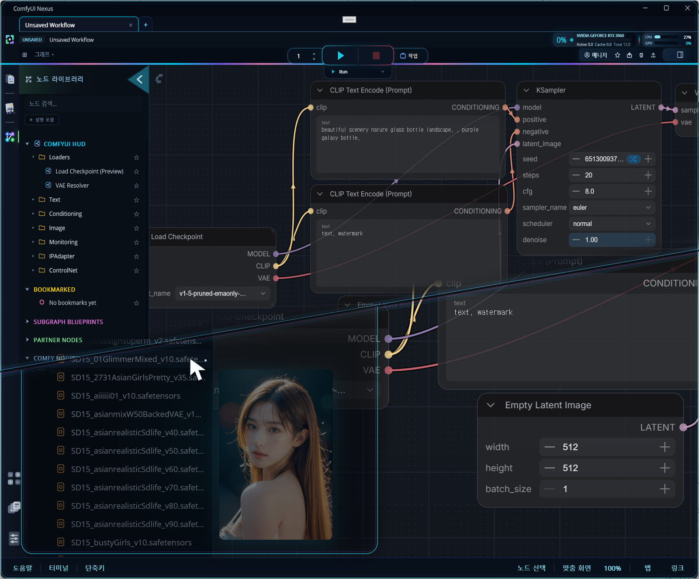
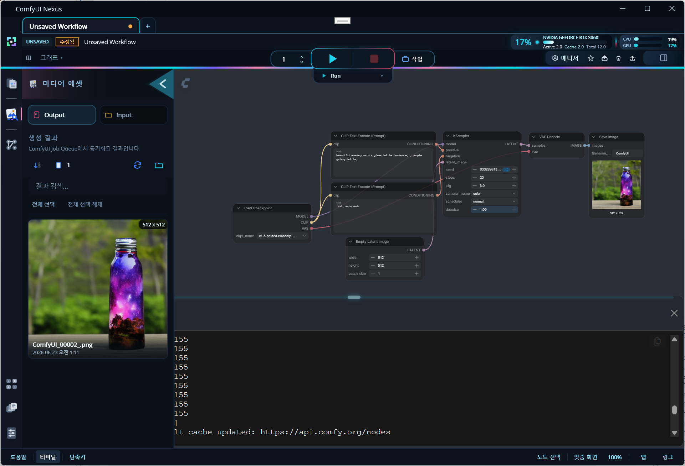

# ComfyUI-Nexus

**Stay in flow.**<br>
**Let Nexus handle the setup, runtime, and files around ComfyUI.**

ComfyUI-Nexus is a native desktop companion for ComfyUI.<br>
ComfyUI remains the workflow engine inside WebView2,<br>
while Nexus adds a focused Windows shell for startup, server control, workflow management, assets, and recovery.

<p align="left">
  
</p>

Language: [English](README.md) | [한국어](README.ko.md)

## Install

For normal use, download the release ZIP and extract the whole folder.

1. Create any writable folder, for example `D:\Nexus`.
2. Extract the release ZIP into that folder.
3. Run `ComfyUI-Nexus.exe` and follow the guided setup UI.

No installer is required.<br>
Keep the files from the ZIP together.
The root executable is a small launcher, while the MAUI app files live in `App`.<br>
Nexus expects `App` and `LocalRuntime\Packages` beside it so Python, Git, and the Nexus bridge can be prepared without an installer.

Nexus creates its settings, installed runtime, cache, state, backup, and log files beside the root launcher:

```text
D:\Nexus\
  ComfyUI-Nexus.exe
  App\
    ComfyUI-Nexus.exe
  nexus_settings.json
  LocalRuntime\
    Packages\
      runtime-package-spec.json
  Backups\
```

Nexus-managed persistent data stays inside this portable folder instead of using AppData.<br>
Keep the folder writable, and move or back up the entire folder
when you want to relocate the installation.

## What Nexus Adds

### Guided Setup And Runtime

- Connect an existing ComfyUI installation, or prepare a Nexus-managed runtime.
- Validate Python, Git, ComfyUI, required packages, and virtual environments.
- Route each launch to setup, maintenance, server boot, process reattachment, or direct loading according to the current machine state.
- Queue heavier repair and maintenance work for a controlled boot sequence.

### Server Control

- Select a GPU, and edit the host, port, Python mode, and launch options.
- Start, retry, recover, or reconnect to a Nexus-launched ComfyUI server.
- Follow live boot logs and server readiness without leaving the app.
- Control queue count, run mode, execution, interruption, and queue state from the native command deck.

### Workflow And Asset Tools

- Browse workflows, models, input files, and output files from the native rail.
- Preview model and image thumbnails directly from the rail without leaving the canvas.
- Search, bookmark, rename, move, copy, duplicate, delete, and organize files with root-specific safety policies.
- Keep ComfyUI's workflow index synchronized with external filesystem changes.
- Insert any validated ComfyUI workflow JSON into the current graph, including files stored outside ComfyUI's workflows directory.
- Track workflow tabs and paths while files are renamed or reorganized.

### Creative Workspace

- Browse nodes, models, and visual references without leaving the canvas.
- Drag supported assets into ComfyUI with Nexus bridge feedback.
- Preview image and video collections in a native viewer with navigation, playback, zoom, and deletion controls.
- Use the managed HUD and Nexus bridge for tighter native/web coordination.

<p align="left">
  
</p>

### Desktop Experience

- Native splash, setup, boot, settings, help, dialogs, blockers, and rail tools.
- English, Korean, Simplified Chinese, and Traditional Chinese shell resources with English fallback.
- File watchers, explicit bridge actions, and diagnostic logs for predictable state synchronization.

## Requirements

- Windows 10 or later
- WebView2 Runtime
- Enough disk space for ComfyUI, Python, Git, models, and generated assets
- .NET 10 SDK and .NET MAUI workloads when building from source

## Build

There are two common build paths.

### Release portable ZIP

Use the bundled build script when you want the same shape as the release package.<br>
Choose the package mode explicitly:

```bat
build-as-binary.bat Release folder
```

The `folder` mode creates this package:

```text
ComfyUI-Nexus.exe
App/
LocalRuntime/
```

The script keeps `bin` and `obj` intact to reduce build-to-build
binary churn during repeated release builds.<br>
If you need a full SDK clean first, run:

```bat
build-as-binary.bat Release folder clean
```

Unsigned Windows desktop builds can occasionally trigger strict
Windows Defender, Smart App Control, or reputation-based checks,
especially right after a clean build.<br>
If that happens during release preparation, run the same build once more
without `clean` and distribute the second artifact:

```bat
build-as-binary.bat Release folder
```

Do not work around security warnings by adding unrelated files to the package.<br>
The release ZIP should contain only the launcher, `App`, and `LocalRuntime`.<br>

If you want the older compact single-file app shape, run:

```bat
build-as-binary.bat Release single
```

The script publishes a self-contained Windows build and writes the release files to:

```text
build/Release_<timestamp>/
  ComfyUI-Nexus.exe
  App/
    ComfyUI-Nexus.exe
  LocalRuntime/
    Packages/
  ComfyUI-Nexus-v<version>-win-x64-portable-folder-<timestamp>.zip
```

The ZIP is the artifact intended for GitHub Releases.<br>
It contains the root launcher, the self-contained app folder,
`runtime-package-spec.json`, and the setup packages Nexus needs on first run.<br>
Extract the ZIP as described in [Install](#install).

### Visual Studio or direct .NET build

Use Visual Studio, or run a normal `dotnet build`, when you are developing and debugging:

```powershell
dotnet build ComfyUI-Nexus.csproj -f net10.0-windows10.0.19041.0
```

This produces standard build output under `bin` and `obj`.<br>
It is useful for iteration, but it is not the cleaned portable ZIP used for releases.

## Project Status

The main setup, startup, server, workflow, asset, media, HUD, and bridge flows are implemented.<br>
Current work is focused on real-world tuning, packaging, and edge-case polish.

## Crash Diagnostics

If Nexus closes unexpectedly, review `LocalRuntime/Logs/nexus-latest.log` first.<br>
The console's `LOG FILE` button opens the latest Nexus app log in the default text app.<br>
Timestamped session logs are stored as `nexus-runtime-<timestamp>-p<pid>.log`,<br>
and ComfyUI server logs are stored as `comfy-server-<timestamp>-*.log`.<br>
Nexus keeps recent session logs so crashes and restart behavior can be compared without relying on AppData.

## License

ComfyUI-Nexus is released under the [MIT License](LICENSE).

## Development

Architecture, ownership boundaries, runtime layout, bridge conventions, and build checks<br>
are documented in the developer guide: [English](docs/DEVELOPERS.md) | [한국어](docs/DEVELOPERS.ko.md).
