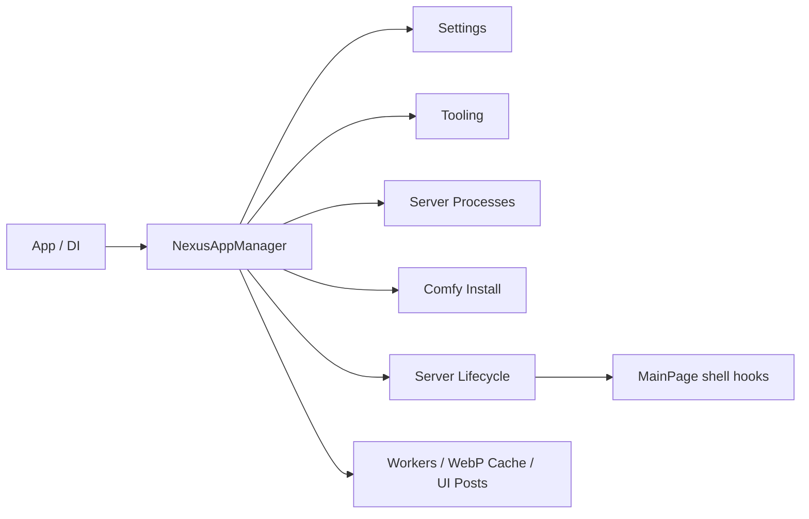

# AppManager Runtime 명세

언어: [English](APP_MANAGER_SPEC.md) | [한국어](APP_MANAGER_SPEC.ko.md)

## 목적

`NexusAppManager`는 앱 실행 전체에서 하나여야 하는 Nexus runtime component의 생성, 소유, 종료 순서를 책임진다.

이는 전역 접근을 늘리는 service locator가 아니다. 
각 consumer는 manager가 제공하는 이름 있는 capability를 직접 받거나, 필요한 dependency를 생성자에서 명시적으로 받는다.

## 단일 객체 계약

다음 component는 앱 process에서 정확히 하나만 존재한다.

| Component | 책임 | 생성 / 종료 owner |
| --- | --- | --- |
| `SetupSettingsService` | 로드된 settings document와 save serialization | `NexusAppManager` |
| `NexusComfyRuntimePaths` | 현재 managed / external ComfyUI 경로 해석 | `NexusAppManager` |
| `NexusToolingEnvironment` | 설치 도구의 scoped path lease | `NexusAppManager` |
| `NexusServerProcessController` | server process registry와 stop verification | `NexusAppManager` |
| `ComfyInstallService` | managed runtime installation과 repair | `NexusAppManager` |
| `GpuDiscoveryService` | GPU discovery cache와 service state | `NexusAppManager` |
| `NexusServerLifecycleCoordinator` | startup, restart, shutdown state machine | `NexusAppManager` |
| `NexusControlDeckWindowService` | optional Control Deck window | `NexusAppManager` |
| `NexusBackgroundWorkerPool` | bounded background execution budget | `NexusAppManager` |
| `NexusAnimatedWebpFrameCache` | process-wide native frame cache budget | `NexusAppManager` |
| `NexusUiPostCoordinator` | latest-only UI post queue | `NexusAppManager` |
| `NexusShellLayoutScaleService` | window-width scale state와 change subscription | `NexusAppManager` |
| `NexusSessionDiagnosticsService` | heartbeat timer, session marker, process-exit subscription | `NexusAppManager` |
| `NexusPreferenceStore` | preference document와 write lock | `NexusAppManager` |
| `NexusDialogService` | dialog overlay host와 close subscription | `NexusAppManager` |
| `NexusRailHoverRegistry` | live rail control reference registry | `NexusAppManager` |
| `NexusExceptionDiagnosticsService` | global exception event subscription | `NexusAppManager` |
| `NexusBindingDiagnosticsService` | debug binding subscription과 dedupe state | `NexusAppManager` |
| `PlatformManager` | platform integration과 cursor resource state | `NexusAppManager` |

manager는 `App`이 DI로 한 번 생성해 앱 종료까지 보관한다. 
manager가 만든 component를 consumer가 대체 생성하거나, 동일 component의 두 번째 instance를 만들면 안 된다.

## Service 판별 기준

다음 질문 중 하나라도 `예`라면 해당 object는 static helper가 아니라 `NexusAppManager`가 소유하는 service/component다.

1. 앱 실행 중 유지되는 mutable state를 보관하는가?
2. timer, event subscription, process handle, cancellation source, queue 또는 cache를 소유하는가?
3. 시작·중지·dispose 순서가 correctness에 영향을 주는가?
4. 같은 종류의 두 번째 instance가 생기면 결과가 모호하거나 위험해지는가?

반대로 input을 받아 결과만 반환하고 retained state나 lifecycle이 없다면 static pure helper로 둔다. 
예를 들어 path normalization, JSON formatting, OS listener one-shot inspection이 이에 해당한다.

## Ownership Matrix

| 종류 | 예시 | 규칙 |
| --- | --- | --- |
| App-lifetime object | `NexusToolingEnvironment`, `PlatformManager`, server lifecycle, WebP cache | `NexusAppManager`가 한 번 만들며 process/window/native lifecycle을 소유한다. |
| Process-global static service | `LocalizationManager`, `NexusLog` | MAUI dependency, external lease, dispose 순서가 없을 때만 허용한다. |
| Stateless worker/helper | `PythonRuntimeProbe`, path normalization, one-shot listener probe | 모든 input을 명시적으로 받고 cache, settings, application state를 소유하지 않는다. |
| Operation-scoped worker | `GitRepositoryService`와 `GitRepositoryOperationContext` | 호출 operation이 만들며 log, progress, cleanup callback, path, executable path를 명시적으로 전달받는다. |
| Shared operation cache | `PythonRuntimeInfoService` | `NexusToolingEnvironment`가 소유한다. Python probe 결과만 cache하며 Python 선택, settings, path를 자체적으로 결정하지 않는다. |
| View-owned object | rail controller, overlay presenter, browser surface adapter | view가 own하고 unload에서 해제한다. `NexusAppManager`에 등록하지 않는다. |

## Tooling Lease 계약

`NexusToolingEnvironment`는 앱 실행 전체에서 `NexusToolingPathLeaseController` 하나를 소유한다. 
각 outer `RunToolingAsync` call은 request-scoped lease다. request 시작에 alias를 acquire하고, request가 끝나기 전에 반드시 반환한다. 
동시에 활성화할 수 있는 tooling lease는 하나이며, nested tooling 호출은 같은 lease를 재사용한다. 
따라서 두 번째 controller나 두 번째 임시 drive mapping을 만들지 않는다. 
mapping은 outer operation과 그 operation이 await한 모든 child process가 끝난 뒤에만 해제한다.

durable mapping registry는 두 번째 runtime owner가 아닌 static file-I/O helper다. 
각 live process owner의 instance ID, process ID, process start time을 기록한다. 
여러 Nexus process가 하나의 Nexus-owned mapping을 함께 사용할 수 있으며, 마지막 live owner가 해제될 때만 mapping을 제거한다. 
startup cleanup은 기록된 process identity가 더 이상 살아 있지 않은지 확인한 뒤 stale owner만 정리하며, 사용자 subst mapping은 절대 해제하지 않는다.

## 접근 규칙

1. `App`과 app-root page는 `App.Runtime`에서 필요한 named capability를 얻는다.
2. service와 controller는 필요한 capability를 constructor parameter로 받는다.
3. view 전용 state는 manager에 넣지 않는다. view가 own하고 unload에서 해제한다.
4. `NexusAppManager.Get<T>()`와 type registry는 금지한다.
5. `NexusAppManager.Instance`는 유일하게 허용하는 app-runtime 전역 진입점이다. 
   의미 있는 이름의 capability만 노출하며 generic service locator로 사용하지 않는다.

## Static 허용 기준

static은 log / diagnostics 진입점, immutable definition, 순수 helper, stateless platform query에 허용한다. 
diagnostics 진입점은 process snapshot을 만들기 위한 diagnostic metadata만 보관할 수 있다. 
대신 runtime subscription, cache budget, task queue, process handle, settings document, UI work item, external-resource lease 같은 운영 resource를 소유하면 안 된다. 
이런 runtime resource는 manager-owned instance가 소유한다.

| 허용 | 예 |
| --- | --- |
| Log / diagnostics entrypoint | `NexusLog`, crash snapshot writer |
| immutable definition / constant | asset id, action name, build metadata |
| pure function | formatting, validation, path normalization |
| stateless platform query | listener / process inspection one-shot helper |

다음 중 하나라도 보관하면 manager-owned instance component여야 한다.

- task, cancellation token, timer, subscription
- cache entry 또는 cache budget
- settings document
- process handle 또는 registry
- UI work item / pending post
- lease / mount / external resource lifetime

`SessionHeartbeatDiagnostics`처럼 이름에 diagnostics가 들어가더라도 timer, state file writer, process-exit subscription을 직접 소유하면 static diagnostics가 아니다. 
이는 `NexusSessionDiagnosticsService`로 manager가 소유하며, static diagnostics는 snapshot 생성과 log write 같은 무상태 entrypoint만 담당한다.

process-global state가 MAUI object와 무관하고 dispose 순서가 필요 없다면 static service를 허용할 수 있다. 
`LocalizationManager`는 language dictionary와 active-language 값만 보관하며, 
`Application.Current`, settings, window, UI handler를 읽지 않는다.

반대로 platform resource는 native handler와 window-bound service를 감싸므로 app-lifetime object다. 
호출부는 `NexusAppManager.Instance.Platform`을 사용하며, 
`PlatformManager.Current` compatibility accessor는 두지 않는다.

## Static 감사 결과

다음 static surface는 의도적으로 유지한다.

| Surface | 유지 이유 |
| --- | --- |
| `NexusLog` | 앱 전체에서 바로 호출해야 하는 logging entrypoint이며, 명시적으로 허용된 예외다. |
| `NexusConcurrencyDiagnostics`, `XamlLifetimeDiagnostics`, `NexusUiActionTrace` | crash / lifetime snapshot을 위한 bounded diagnostic metadata만 보관한다. runtime work나 resource lifetime은 소유하지 않는다. |
| `NexusStorageLayout` | build profile로 결정되는 immutable storage resolution이다. live runtime path selection은 manager-owned `NexusComfyRuntimePaths`가 담당한다. |
| `NexusToolingPathLeaseRegistry` | process identity를 검증해 stale mapping만 정리하는 durable 사용자별 ownership registry다. live lease는 소유하지 않으며, live controller는 manager-owned tooling environment가 소유한다. |
| `LocalizationManager` | MAUI나 dispose dependency 없이 process 전체의 language dictionary와 active-language state만 보관한다. |
| MAUI `BindableProperty`, constants, catalogs, P/Invoke, pure helpers | framework requirement 또는 immutable/pure definition이다. |

`NexusShellLayoutScaleService`는 이 감사에서 발견된 운영 상태였다. 
window width, current scale, change subscription을 보관하므로 static helper가 아니라 AppManager component로 이동했다.

## Lifecycle 계약

- server lifecycle은 GPU service와 shell hook을 순차적으로 quiesce / start한다.
- UI post와 WebP frame cache는 server lifecycle 완료를 await하지 않는다.
- app exit에서는 Control Deck을 먼저 닫고, UI post와 worker admission을 닫은 뒤
  cache와 remaining manager resource를 dispose한다.
- tooling path lease는 install child process가 모두 끝난 후에만 release한다.

## Migration 완료 기준

1. `SetupSettingsService.Instance`와 app-wide compatibility singleton reference가 없다.
2. manager 밖의 mutable static state는 process-global이며 app/window lifecycle과 분리된 경우에만
   명시적으로 허용한다. 예: `LocalizationManager`.
3. app-lifetime service의 생성자는 `NexusAppManager` 하나에만 있다.
4. 종료 시 manager-owned worker, UI post, cache, Control Deck이 late write 없이 정리된다.
5. Portable / Store가 같은 runtime contract를 따르며 profile 차이는 storage와 packaging에만 남는다.
6. session heartbeat와 process-exit subscription은 `NexusSessionDiagnosticsService` 하나가 소유한다.
