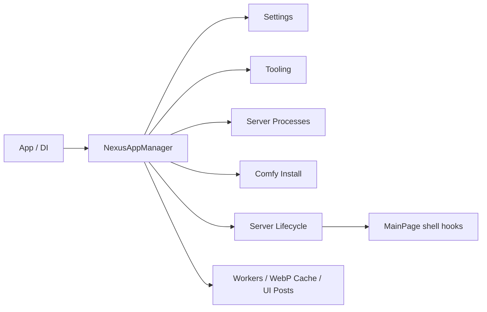

# AppManager Runtime Specification

Language: [English](APP_MANAGER_SPEC.md) | [한국어](APP_MANAGER_SPEC.ko.md)

## Purpose

`NexusAppManager` owns the creation, lifetime, and shutdown order of Nexus runtime
components that must exist exactly once for an app process.

It is not a service locator. 
Each consumer receives a named capability from the manager or declares the required
dependency explicitly through its constructor.

## Singleton Contract

The following components exist exactly once per app process.

| Component | Responsibility | Creation / shutdown owner |
| --- | --- | --- |
| `SetupSettingsService` | Loaded settings document and save serialization | `NexusAppManager` |
| `NexusComfyRuntimePaths` | Resolves the current managed / external ComfyUI paths | `NexusAppManager` |
| `NexusToolingEnvironment` | Scoped tooling-path leases | `NexusAppManager` |
| `NexusServerProcessController` | Server-process registry and stop verification | `NexusAppManager` |
| `ComfyInstallService` | Managed runtime installation and repair | `NexusAppManager` |
| `GpuDiscoveryService` | GPU discovery cache and service state | `NexusAppManager` |
| `NexusServerLifecycleCoordinator` | Startup, restart, and shutdown state machine | `NexusAppManager` |
| `NexusControlDeckWindowService` | Optional Control Deck window | `NexusAppManager` |
| `NexusBackgroundWorkerPool` | Bounded background execution budget | `NexusAppManager` |
| `NexusAnimatedWebpFrameCache` | Process-wide native frame-cache budget | `NexusAppManager` |
| `NexusUiPostCoordinator` | Latest-only UI post queue | `NexusAppManager` |
| `NexusShellLayoutScaleService` | Window-width scale state and change subscription | `NexusAppManager` |
| `NexusSessionDiagnosticsService` | Heartbeat timer, session marker, and process-exit subscription | `NexusAppManager` |
| `NexusPreferenceStore` | Preference document and write lock | `NexusAppManager` |
| `NexusDialogService` | Dialog overlay host and close subscription | `NexusAppManager` |
| `NexusRailHoverRegistry` | Live rail-control reference registry | `NexusAppManager` |
| `NexusExceptionDiagnosticsService` | Global exception event subscription | `NexusAppManager` |
| `NexusBindingDiagnosticsService` | Debug binding subscription and dedupe state | `NexusAppManager` |
| `PlatformManager` | Platform integration and cursor resource state | `NexusAppManager` |

`App` receives the manager through DI once and retains it until app exit. 
Consumers must not create replacement components or second instances of any manager-owned component.

## Service Classification

An object belongs to `NexusAppManager` rather than a static helper when any of these
answers is yes:

1. Does it retain mutable state for the lifetime of the app?
2. Does it own a timer, event subscription, process handle, cancellation source,
   queue, or cache?
3. Does its start, stop, or disposal order affect correctness?
4. Would a second instance make ownership ambiguous or unsafe?

Conversely, an object remains a static pure helper when it receives input and returns a
result without retained state or lifecycle. 
Examples include path normalization, JSON formatting, and one-shot OS listener inspection.

## Ownership Matrix

| Kind | Examples | Rule |
| --- | --- | --- |
| App-lifetime object | `NexusToolingEnvironment`, `PlatformManager`, server lifecycle, WebP cache | Created once by `NexusAppManager`; owns process/window/native lifecycle. |
| Process-global static service | `LocalizationManager`, `NexusLog` | Allowed only when it has no MAUI dependency, no external lease, and no disposal ordering requirement. |
| Stateless worker/helper | `PythonRuntimeProbe`, path normalization, one-shot listener probe | Receives every input explicitly; owns no cache, settings, or application state. |
| Operation-scoped worker | `GitRepositoryService` with `GitRepositoryOperationContext` | Created by the calling operation and receives logging, progress, cleanup callback, paths, and executable paths as explicit input. |
| Shared operation cache | `PythonRuntimeInfoService` | Owned by `NexusToolingEnvironment`; caches Python probe results but does not choose Python, settings, or paths itself. |
| View-owned object | Rail controller, overlay presenter, browser surface adapter | Owned by the view and released at unload; never registered in `NexusAppManager`. |

## Tooling Lease Contract

`NexusToolingEnvironment` owns one `NexusToolingPathLeaseController` for the app run. 
Each outer `RunToolingAsync` call is a request-scoped lease: it acquires an alias at entry
and must return it before the request completes. 
At most one tooling lease is active at a time, and nested tooling calls reuse that lease. 
They never create a second controller or a second temporary drive mapping. 
The mapping is released only after the outer operation and every awaited child process finish.

The durable mapping registry is a static file-I/O helper, not a second runtime owner. 
It records each live process owner with an instance ID, process ID, and process start time. 
Multiple Nexus processes can share a Nexus-owned mapping; it is removed only after the final
live owner releases it. 
Startup cleanup removes stale owners only after validating that their recorded process identity
is no longer alive, and it never removes a user-created `subst` mapping.

## Access Rules

1. `App` and app-root pages obtain named capabilities from `App.Runtime`.
2. Services and controllers receive dependencies through constructor parameters.
3. View-only state stays out of the manager; its view owns and releases it at unload.
4. `NexusAppManager.Get<T>()` and type registries are prohibited.
5. `NexusAppManager.Instance` is the one allowed global app-runtime entry point. 
   It exposes named capabilities only and must not become a generic service locator.

## Static Boundary

Static code is allowed for logging and diagnostic entry points, immutable definitions,
pure helpers, and stateless platform queries. 
Diagnostic entry points may retain only diagnostic metadata required to create a process snapshot. 
They must not own runtime subscriptions, cache budgets, task queues, process handles, settings
documents, UI work items, or external-resource leases. 
Those runtime resources belong to a manager-owned instance.

| Allowed category | Examples |
| --- | --- |
| Logging / diagnostics entry point | `NexusLog`, crash snapshot writer |
| Immutable definition / constant | Asset ID, action name, build metadata |
| Pure function | Formatting, validation, path normalization |
| Stateless platform query | One-shot listener / process inspection helper |

If an object retains any of the following, it must be a manager-owned instance component:

- Task, cancellation token, timer, or subscription
- Cache entry or cache budget
- Settings document
- Process handle or registry
- UI work item / pending post
- Lease, mount, or external resource lifetime

Even when its name contains diagnostics, an object such as `SessionHeartbeatDiagnostics` is not
a static diagnostic entry point if it directly owns a timer, state-file writer, or process-exit
subscription. 
`NexusSessionDiagnosticsService` is therefore manager-owned; static diagnostics handle only
stateless entry points such as snapshot creation and log writing.

A static service is allowed when its state is process-global, independent from MAUI objects,
and needs no disposal order. 
`LocalizationManager` retains only language dictionaries and the active-language value; 
it does not read `Application.Current`, settings, windows, or UI handlers.

Platform resources instead wrap native handlers and window-bound services, so they are
app-lifetime objects. 
Call sites use `NexusAppManager.Instance.Platform`; no `PlatformManager.Current`
compatibility accessor exists.

## Static Audit Result

The following static surfaces remain intentionally.

| Surface | Reason it remains static |
| --- | --- |
| `NexusLog` | An explicitly allowed logging entry point that must remain convenient at every app boundary. |
| `NexusConcurrencyDiagnostics`, `XamlLifetimeDiagnostics`, `NexusUiActionTrace` | Retain only bounded diagnostic metadata for crash and lifetime snapshots. They do not own runtime work or resource lifetime. |
| `NexusStorageLayout` | Immutable storage resolution derived from the build profile. Live managed/external path selection belongs to manager-owned `NexusComfyRuntimePaths`. |
| `NexusToolingPathLeaseRegistry` | Durable per-user ownership registry that validates process identity before stale cleanup. It never owns a live lease; the manager-owned tooling environment owns the live controller. |
| `LocalizationManager` | Process-global language dictionaries and active-language state with no MAUI or disposal dependency. |
| MAUI `BindableProperty`, constants, catalogs, P/Invoke, and pure helpers | Framework requirements or immutable/pure definitions. |

`NexusShellLayoutScaleService` was operational state discovered by this audit. 
It retains window width, current scale, and change subscriptions, so it moved from a static
helper to an AppManager component.

## Lifecycle Contract

- Server lifecycle quiesces and starts the GPU service and shell hooks sequentially.
- UI posts and the WebP frame cache do not await server lifecycle completion.
- On app exit, Control Deck closes first; UI post and worker admission close next; cache and
  remaining manager resources are then disposed.
- A tooling-path lease is released only after all installation child processes finish.

## Migration Completion Criteria

1. No `SetupSettingsService.Instance` or app-wide compatibility singleton reference remains.
2. Mutable static state outside the manager is explicitly allowed only when it is process-global
   and detached from app/window lifecycle; for example, `LocalizationManager`.
3. `NexusAppManager` is the only construction point for app-lifetime services.
4. On shutdown, manager-owned workers, UI posts, caches, and Control Deck release without late writes.
5. Portable and Store builds share the same runtime contract; profile differences remain limited
   to storage and packaging.
6. One `NexusSessionDiagnosticsService` owns the session heartbeat and process-exit subscription.
